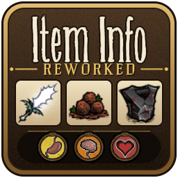

# Item Info Reworked

**Item Info Reworked** is a client-side mod for *Don't Starve Together* by **Alti**. It displays detailed item statistics when hovering over inventory, equipment and container slots, together with a compact panel summarizing your equipped gear. As a client-only mod, it is compatible with any server.

Version 2.0.0 is a complete rework: every script has been rewritten against the current game code, long-standing bugs and crashes have been resolved, and coverage has been extended to recent content.

## Features

| Category | Information shown |
|---|---|
| **Food** | Hunger, sanity and health calculated for your character, accounting for freshness, spices, favorite foods (highlighted with a star) and dietary restrictions. Warming and cooling foods are indicated. |
| **Spoilage** | Freshness and time until stale and rotten, adjusted for containers (Ice Box, Insulated Pack, Polar Bearger Bin, Salt Box, Fish Box, Seed Pouch, mushroom lights), frozen items, wetness and season. |
| **Combat** | Damage including character multipliers, set bonuses and skill tree perks; planar damage and defense with lunar and shadow indicators; bonuses against aligned creatures; slingshot ammunition and Wortox's Knabsack. |
| **Armor** | Damage absorption, durability, planar defense and resistance to lunar and shadow creatures. |
| **Clothing** | Sanity per minute, movement speed, insulation and waterproofing. |
| **Durability** | Remaining uses, fuel and wear time, Thermal Stone uses and temperature, and the health of placeable structures such as walls, bumpers and boats. |

Values provided by set bonuses and skills are shown in green; low durability (20% or less) is shown in red.

## What's new in 2.0.0

- Resolved the issue where item information remained on screen after swapping a backpack for armor, along with the associated memory leak.
- Resolved crashes involving merm tools, the Gloomerang, depleted Brightshade weapons, creatures held in the inventory and modded items with incomplete data. Unexpected errors are now contained and logged instead of crashing the game.
- When hosting a world, values are read directly from the game, so new characters, skills and balance changes are reflected automatically.
- Tooltips are positioned above the game's item text and beside open containers, so they no longer obscure other slots.
- Improved performance: a single shared tooltip that only rebuilds when a displayed value changes.
- Settings available in English and Simplified Chinese, with per-category toggles, adjustable background opacity, an optional toggle hotkey and support for additional equipment slots added by other mods.

## Installation

1. Subscribe to the mod on the [Steam Workshop](https://steamcommunity.com/sharedfiles/filedetails/?id=3118627881).
2. Enable it in the **Mods** menu of *Don't Starve Together*.
3. Adjust the settings to your preference.

## Configuration

All options are available from the mod's configuration screen. Notable settings include:

- **Toggle key:** an optional key to show or hide the tooltips and the equipment panel in game (disabled by default).
- **Shown info:** enable or disable food, spoilage, combat, clothing and durability information individually.
- **Use with Insight / Show Me:** when set to *No*, the mod disables itself on servers running Insight, Show Me or Show Me (中文) to avoid duplicate information.

## Reporting issues

Please include the relevant lines from `Documents\Klei\DoNotStarveTogether\client_log.txt` (they begin with `[Item Info Reworked]`) and a short description of what you were doing when the issue occurred.
